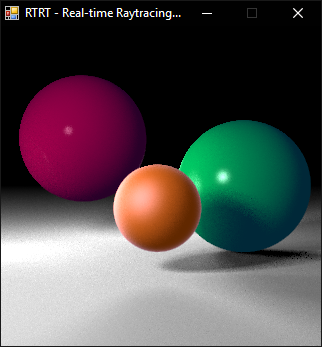
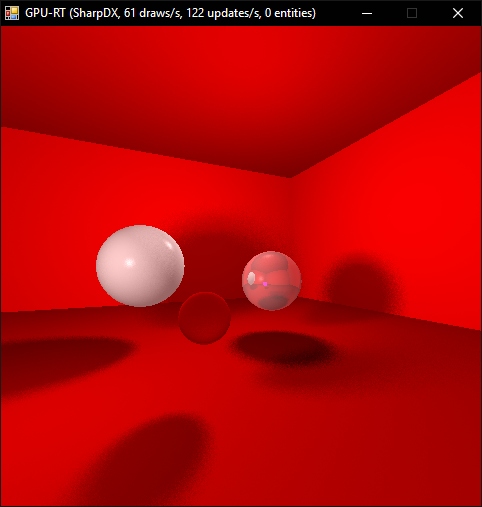
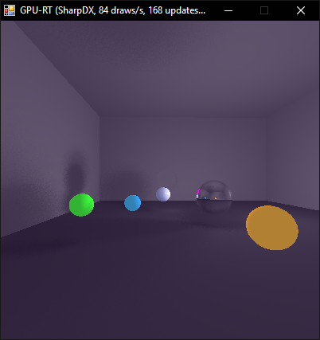

Raytracing in real-time on the GPU
##################################

Real-time raytracer implemented in HLSL. The raytracer runs on the GPU, not the CPU. This allows for parallelization pf pixel calculations on the GPU's shader units, resulting in thousand-fold speedup for the raytracing process, compared to `software rendering <https://github.com/philiparvidsson/raytracing>`_.

Features
========

* Adaptive antialiasing (not working too well)
* Keyboard controls
* Parallelization through use of shader units on GPU
* Phong shading model
* Soft shadows/shadow ray sampling (Monte Carlo integration)

Building and Running
====================

1. Clone this repository.
2. Chdir into the project root.
3. Type :code:`python make.py init`
4. Type :code:`python make.py scene0` to run the first scene, or :code:`python make.py scene1` to run the second scene.

**NOTE**: *Scenes can take a long time to load!*
Screenshots
===========

Videos
======

.. image:: https://img.youtube.com/vi/bbuAzrRJE0w/0.jpg
   :target: https://youtu.be/bbuAzrRJE0w

.. image:: https://img.youtube.com/vi/Q9mNYSZ0fLY/0.jpg
   :target: https://youtu.be/Q9mNYSZ0fLY
